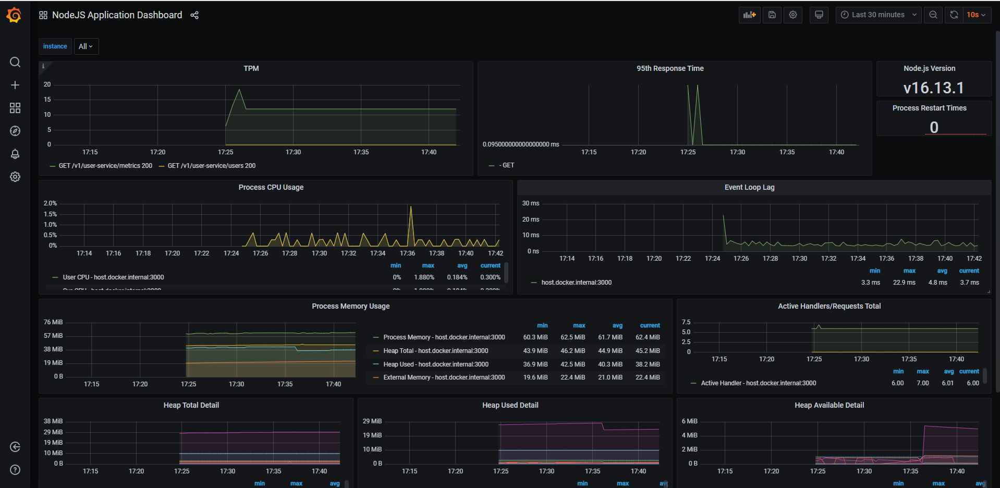

<!-- ABOUT THE PROJECT -->

## About The Project

A full fledge rest app powered by express.

<!-- GETTING STARTED -->

### Built With

This section list all major frameworks/libraries used in this project.

- [Node](https://nodejs.org)
- [Express](https://expressjs.com/)
- [Sequelize](https://sequelize.org/)
- [Swagger-ui-express](https://www.npmjs.com/package/swagger-ui-express)
- [Mocha](https://mochajs.org/)

(<a href="#top">back to top</a>)

## Getting Started

This is an example of how you may give instructions on setting up your project locally.

### Prerequisites

- You need a mongoDB up and running. To do that, use docker  
  You can run it as a [docker](https://hub.docker.com/_/mongo) or install it as a [standalone application](https://www.mongodb.com/try/download/community)

- Node.js > v14 needed. You can get it [here](https://nodejs.org/en/download/)
- Better install mocha on global level `npm install --global mocha`

(<a href="#top">back to top</a>)

### Installation

1. Go to your command-line interface and type `npm install`. ( here assumption is mysql is available)

(<a href="#top">back to top</a>)

<!-- USAGE EXAMPLES -->

## Usage

Type `npm start`. Few lines will comes up and then go to ["http://localhost:3000/user-service/docs"](http://localhost:3000/user-service/docs/#/). You should see swagger doc

(<a href="#top">back to top</a>)

## Features

1. Out of the box swaggerUI
2. Request and response validation
3. Application [Metrics](#metrics)
4. [Sorting](#sorting), projection and [pagination](#pagination) support
5. Test cases available with 100 % coverage

(<a href="#top">back to top</a>)

<!-- ROADMAP -->

## Roadmap

- [X] Add basic test cases
- [X] Add Metrics
- [ ] Add correlationId to every log
- [ ] Add projection support
- [ ] Add pagination and projection test cases
- [ ] Add filters

<!-- Sorting -->
## Sorting

Documents can be sorted using the parameter `$sortBy`. This parameter is a combination of the sorting order and sorting field. For more information, see generated [swagger docs](http://localhost:3000/user-service/docs/#/). To control what fields you can sort, go to `/api/helpers/queryHooks.js` and inside the `mapping` function modify the `sortFields` keys

(<a href="#top">back to top</a>)

<!-- Pagination -->
## Pagination
 By Default applications exposes, pagination parameters `$top` and `$skip`

 
(<a href="#top">back to top</a>)

<!-- Application Metrics -->
## Metrics

All the application metrics like CPU usages, event lag delay, TPM, and p95 are available.

The application `/metrics` end point gives the [prometheus](https://prometheus.io/) compatible data. If you want to see what it will look likes, just inside the `metric` folder and docker-compose-up command. It will run Prometheus on the 9090 port and Grafann on the 9000 port. Go to Grafana dashboard. Go to grafana dashboard [locally](http://localhost:9000/). You should see something like:

(<a href="#top">back to top</a>)

<!-- CONTRIBUTING -->
## Contributing

Contributions are what make the open source community such an amazing place to learn, inspire, and create. Any contributions you make are **greatly appreciated**.

If you have a suggestion that would make this better, please fork the repo and create a pull request. You can also simply open an issue with the tag "enhancement".
Don't forget to give the project a star! Thanks again!

1. Fork the Project
2. Create your Feature Branch (`git checkout -b feature/AmazingFeature`)
3. Commit your Changes (`git commit -m 'Add some AmazingFeature'`)
4. Push to the Branch (`git push origin feature/AmazingFeature`)
5. Open a Pull Request

(<a href="#top">back to top</a>)

